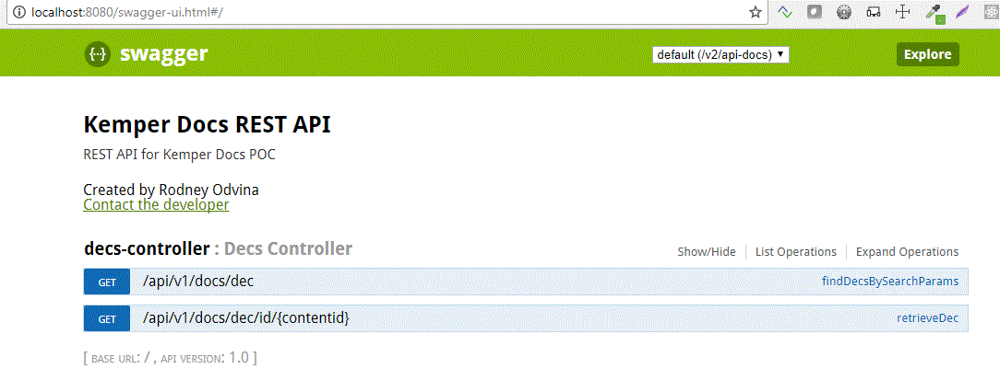

## rest-kemperdocs ##

#### Prerequisites
* Java 8
* Eclipse IDE with Spring Tooling feature (install from Marketplace)
* This is a Spring Boot app and so can run in an embedded Tomcat server locally.
* The gradle build is setup to build a deployable war (for non-local envs)
* Configuration files (`application.*.properties`) are externalized and located in separate repo, [rest-kemperdocs-config](http://stash.kemperi.com:7990/projects/DEP/repos/rest-kemperdocs-config/browse).  You must also clone this repo into your workspace as a general project.  For more info on Spring Boot Externalized Configuration, read [this](https://docs.spring.io/spring-boot/docs/current/reference/html/boot-features-external-config.html).

#### Clone and configure Gradle for Eclipse
Clone both the [rest-kemperdocs](http://stash.kemperi.com:7990/projects/DEP/repos/rest-kemperdocs/browse) and [rest-kemperdocs-config](http://stash.kemperi.com:7990/projects/DEP/repos/rest-kemperdocs-config/browse) repos.

After cloning the project into eclipse, you can configure the **rest-kemperdocs** project to use gradle in 1 of 2 ways:

##### via Command line via Gradle
cd into the project within the repo, then run `gradlew eclipse`
		
		cd c:\mongo\EGit_Repositories\rest-kemperdocs\rest-kemperdocs 
		gradlew eclipse

Or
##### via Eclipse
if your IDE has the Gradle Buildship plugin, right click the project then choose `Configure | Add Gradle Nature`

#### Build and Run
Running the application requires passing the `spring.config.location` and `spring.profiles.active` properties.  This allows the application to use the appropriate profile and configuration files.

##### via Command line via Gradle
Make sure you are in the root of the project folder, then

		gradlew bootRun -Pargs="--spring.config.location=C:\mongo\EGit_Repositories\rest-kemperdocs-config\config\ --spring.profiles.active=local"

OR

##### via Eclipse via SpringBoot plugin

From STS, right-click the project and select `Run As | Spring Boot App` (shortcut is `Alt-Shift-X, B`) 

Before running, this configure the run by choosing local as your profile

then set the `spring.config.location` program arg to the folder path of the configuration files.  In this case, it should be the local **rest-kemperdocs-config** repo location 

		--spring.config.location=file:///C:/mongo/EGit_Repositories/rest-kemperdocs-config/config/

#### REST API

REST API is available, generated by [SpringFox](https://springfox.github.io/springfox/) using [Swagger](https://swagger.io/).  Access the api via [http://localhost:8080/swagger-ui.html](http://localhost:8080/swagger-ui.html).  

The api allows you to try the service by entering the parameters for a specific operation and hitting the `Try it out!` button

#### Testing the service
You can also just use your browser or a browser extension such as YARC or RESTClient to hit the service.

